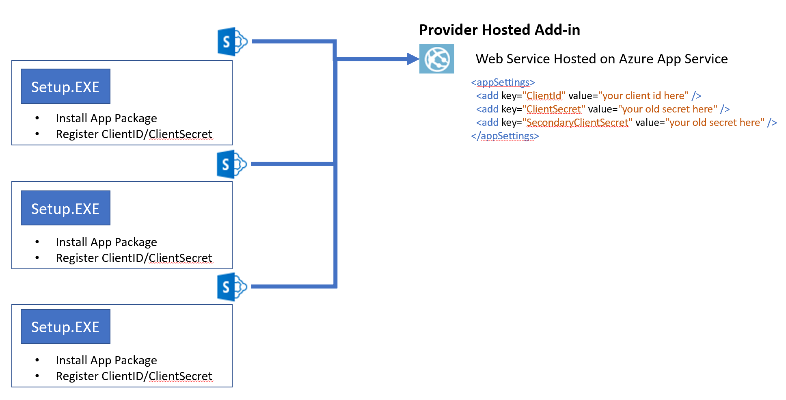

この投稿では、MSOnline モジュールの廃止に伴う SharePoint アドインへの影響について記載します。
多くの場合は代替コマンドでご対応いただくことが出来ますが、特定の運用方法をご利用の場合（特にアプリケーション プロバイダーとして複数テナントにストアを介さずに SharePoint アドインを配布している場合）は、ご自身のアドインが影響を受けないか今一度ご確認ください。

## MSOnline モジュールの廃止後の SharePoint アドインのクライアント シークレットの更新方法

組織のアプリ カタログもしくは AppRegNew.aspx ページを使用して登録した SharePoint アドインのクライアント シークレットは、以下の公開情報に記載の [New-MsolServicePrincipalCredential](https://learn.microsoft.com/ja-jp/powershell/module/msonline/new-msolserviceprincipalcredential?view=azureadps-1.0) コマンドで更新することが出来ました。

公開情報：[SharePoint アドインで期限が切れたクライアント シークレットを置換する](https://learn.microsoft.com/ja-jp/sharepoint/dev/sp-add-ins/replace-an-expiring-client-secret-in-a-sharepoint-add-in#generate-a-new-secret)

``` PowerShell
New-MsolServicePrincipalCredential -AppPrincipalId $clientId -Type Password -Usage Verify -Value $newClientSecret -StartDate $dtStart -EndDate $dtEnd
```

しかしながら、MSOnline モジュールは 2023 年 6 月 30 日に廃止される予定であり、これに伴い New-MsolServicePrincipalCredential コマンドも利用できなくなります。（MSOnline モジュールの廃止につきましては、こちらの[ブログ](https://techcommunity.microsoft.com/t5/microsoft-entra-azure-ad-blog/azure-ad-change-management-simplified/ba-p/2967456)をご参照ください。）

MSOnline モジュールの廃止後は、Microsoft Graph PowerShell モジュールの New-MsolServicePrincipalCredential コマンドの代替コマンドとして [Add-MgServicePrincipalPassword](https://learn.microsoft.com/en-us/powershell/module/microsoft.graph.applications/add-mgserviceprincipalpassword?view=graph-powershell-1.0) コマンドでクライアント シークレットを更新いただけます。

``` PowerShell
Import-Module Microsoft.Graph.Applications
$params = @{
	PasswordCredential = @{
		DisplayName = "Password friendly name"
	}
}
Add-MgServicePrincipalPassword -ServicePrincipalId $servicePrincipalId -BodyParameter $params
```

## どの様な影響があるか

従来の New-MsolServicePrincipalCredential コマンドではクライアント シークレットを前もって生成した後で、その値を引数として指定することが出来ました。しかし、代替の Add-MgServicePrincipalPassword コマンドでは、クライアント シークレットに Azure AD が生成したランダムな値を自動的に登録するため、管理者が前もって用意していたシークレットの値を指定することが出来ません。

残念ながら、Add-MgServicePrincipalPassword コマンドでクライアント シークレットの値を指定可能になる予定はございません。（代替方法が提供された際には、本ブログを更新いたします。）

そのため、アプリの運用の一環として特定のクライアント シークレットの値を指定する必要がある場合、運用方法の見直しをご検討いただく必要がございます。

クライアント シークレットの値を指定する必要がある運用の一例として、プロバイダー ホスト型アドインを複数テナントにストアを介さずに展開する運用方法が考えられます。
下図のように、プロバイダーはアプリのインストーラー等で各テナントにアドインを登録し、その時に同一のクライアント シークレットを指定して登録することで、プロバイダーは各テナントに同じシークレットを使用して接続することが可能になります。MSOnline モジュールの廃止後は、シークレットを指定して登録することが出来ないため、各テナントで登録されたシークレットがそれぞれ別のランダム値となります。その結果、同じクライアント ID とシークレットを共有する運用は不可能となり、運用方法の見直しを検討いただく必要があります。



## 必要な対応について

クライアント シークレットに特定の値を指定する必要が無い場合は、代替の [Add-MgServicePrincipalPassword](https://learn.microsoft.com/en-us/powershell/module/microsoft.graph.applications/add-mgserviceprincipalpassword?view=graph-powershell-1.0) コマンドを使用できますので、コマンドの切り替え以外の対応は不要です。

クライアント シークレットに特定の値を指定する必要がある場合は、シークレットを指定しない運用方法に切り替えていただく必要がございます。
しかしながら、短期間で運用方法を変更することは非常に困難と認識しております。
取り急ぎの対処として、クライアント シークレットを特定の値に指定する必要がある場合は、MSOnline モジュールが廃止される 2023 年 6 月 30 日までに、[New-MsolServicePrincipalCredential](https://learn.microsoft.com/ja-jp/powershell/module/msonline/new-msolserviceprincipalcredential?view=azureadps-1.0) コマンドで　SharePoint アドインのクライアント シークレットを更新して有効期限を延長することをお勧めいたします。
その後、クライアント シークレットの有効期限までに、シークレットを指定しない運用方法への切り替えを実施くださいますようお願いいたします。

<考えられる代替方法>
- SharePoint ストアでアドインを展開し、[販売者ダッシュボードからシークレットを更新する](https://learn.microsoft.com/ja-jp/partner-center/marketplace/create-or-update-client-ids-and-secrets)
- Azure AD のマルチテナント アプリを使用してアプリ専用の権限のアクセス トークンを取得する（ユーザー委任の権限は従来のシステムを使用することが可能）
- SharePoint アドインを SharePoint Framework ソリューションに置き換える（アプリ全体の修正が必要）


今回の投稿は以上です。
不明な点などがありましたら、弊社サポートサービスまでお気軽にお問い合わせください。