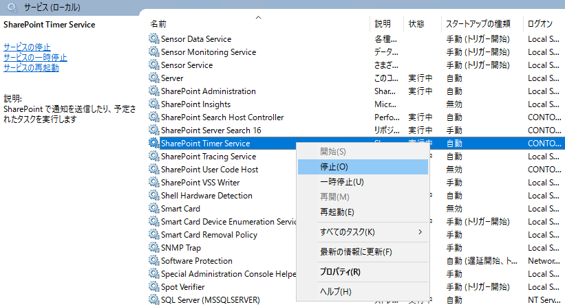
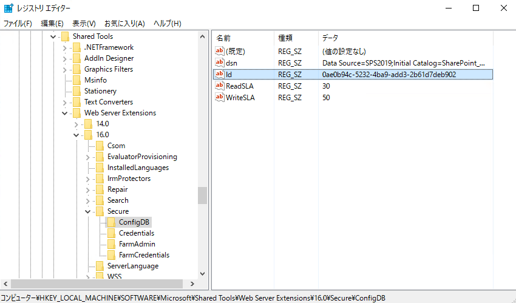
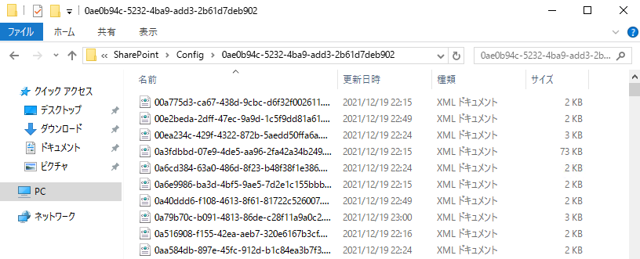
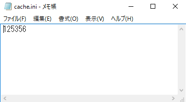
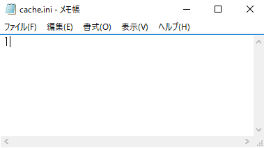
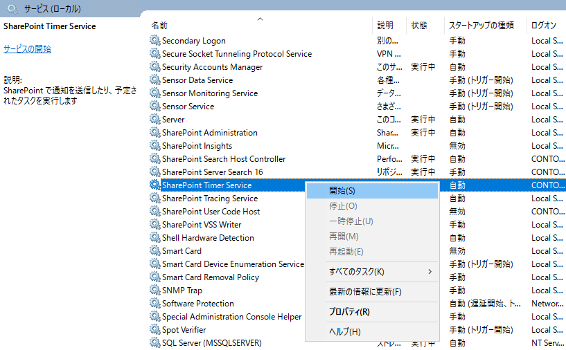

# 構成キャッシュの再作成 (SharePoint Server)

> 本投稿は、以前の [SharePoint サポート フォーラムの投稿](https://social.msdn.microsoft.com/Forums/ja-JP/590627a7-d369-47b2-bfc8-7726d7cf9342/2708325104124611251512483124711251712398208772031625104?forum=sharepointsupportteamja "構成キャッシュの再作成") を元に、内容を一部加筆・修正したものとなります。

> 本投稿は、オンプレミスの SharePoint Server 2013, SharePoint Server 2016, SharePoint Server 2019, SharePoint Server Subscription Edition に適用されます。Microsoft 365 の SharePoint Online には適用されませんので、ご注意ください。

SharePoint Server では、パフォーマンスの観点から、SharePoint の構成データベース (SharePoint_Config) のデータの大部分を、SharePoint サーバー上のローカルのファイル システム内に XML ファイルとしてキャッシュ (構成キャッシュ) を保持しています。

[データベースの種類と説明 (SharePoint Server)](https://docs.microsoft.com/ja-jp/sharepoint/technical-reference/database-types-and-descriptions#configuration "データベースの種類と説明 (SharePoint Server)")

構成キャッシュは、SharePoint Timer Service (SPTimerV4 / OWSTIMER.EXE) によるタイマー ジョブの実行の際に使用するキャッシュ情報となります。この構成キャッシュの内容に不整合が生じた場合、様々な問題が発生することが過去事例より確認されております。

<一例>
- SharePoint の各タイマー ジョブが正常に実行されない ("即時の通知" による通知メールが送信されない、SharePoint の診断ログの出力レベルの変更コマンド内容が正常に反映されない、ソリューションの取り消しが行えない、等)
- 検索関連の問題が発生する (クロールが開始・完了しない、インデックス リセットが行えない、検索トポロジーの変更ができない、等)
- サイトのアクセスが行えない
- 新規のサイト コレクションを作成できない

上記の事象は、あくまでも構成キャッシュの不整合によって発生した事象の一例となります。弊社サポートにお問合せいただいた際に、構成キャッシュの不整合が疑われるような状況の場合、はじめに弊社サポートからは構成キャッシュの再作成を依頼させていただくことがございます。
本投稿では、構成キャッシュの再作成の手順について、具体的な手順をご案内いたします。

***

目次
- [手動による構成キャッシュの再作成手順](#手動による構成キャッシュの再作成手順)
    - [作業による影響](#作業による影響)
    - [作業対象](#作業対象)
    - [作業手順](#作業手順)
- [スクリプトを使用した構成キャッシュの再作成手順](#スクリプトを使用した構成キャッシュの再作成手順)
    - [作業による影響](#作業による影響-1)
    - [作業対象](#作業対象-1)
    - [作業手順](#作業手順-1)
- [構成キャッシュの不整合が発生する要因](#構成キャッシュの不整合が発生する要因)

***

## 手動による構成キャッシュの再作成手順
ここでは、手動による構成キャッシュの再作成手順をご案内いたします。

###  作業による影響
SharePoint Server 2016 においては、キャッシュのクリアを実施中にユーザーアクセスが発生した際に、サイトアクセスに失敗するといった事例を確認しております。
SharePoint Server 2016 以外の SharePoint Server 製品では同様の事例は確認されておりませんが、構成キャッシュの削除によってページが正常に表示されない事象が発生した場合に備え、構成キャッシュの再作成の手順を実施後に IISRESET コマンドによる IIS の再起動を実施いただくことを推奨しております。
IISREST コマンドの実施中は、ユーザーがサイトにアクセス出来なくなるため、ユーザーのご利用の少ない時間帯や営業時間外にご実施ください。
また、タイマーサービスの停止中には、一時的にタイマー ジョブが実行されません。このため、作業時間帯にクロールの開始などがスケジュールされていた場合、これらのスケジュールは実行されませんのでご注意ください。
ただし、これらは一時的な影響であり、次回のスケジュール時にサービスが再開されていれば問題ございません。

### 作業対象
ローカルの管理者権限を持つアカウントで作業対象の SharePoint サーバーにログオンを行い、[作業手順](#作業手順) に記載されている手順を SharePoint サーバーごとに (1 台ずつ) 実施します。

### 作業手順
1. SharePoint サーバー上で動作している SharePoint Timer Service を停止します。
    - 1-1) [管理ツール] から [サービス] を起動します。
    - 1-2) サービスの一覧から、"SharePoint Timer Service" を右クリックして、さらに [停止] をクリックします。

    

2. SharePoint サーバーのローカルのファイル システムに保存されている構成キャッシュ ファイルを削除します。
    - 2-1) レジストリ エディターを起動します。
    - 2-2) 下記のレジストリの値 (GUID) を確認します。

        ※本手順で確認したレジストリの値は、同じファーム内の別の SharePoint サーバーでも同一の値となりますため、これ以降の SharePoint サーバーではレジストリの値を確認する必要はございません。 

        - SharePoint Server 2013 の場合: `HKEY_LOCAL_MACHINE\SOFTWARE\Microsoft\Shared Tools\Web ServerExtensions\15.0\Secure\ConfigDB\Id`
        - SharePoint Server 2016, SharePoint Server 2019, SharePoint Server Subscription Edition の場合: `HKEY_LOCAL_MACHINE\SOFTWARE\Microsoft\Shared Tools\Web ServerExtensions\16.0\Secure\ConfigDB\Id`
        
        
    - 2-3) エクスプローラー上で、下記のパスに移動します。下記の画面ショットの通り、XML ファイルが大量に存在するフォルダとなります。

        `%ALLUSERSPROFILE%\Microsoft\SharePoint\Config\<上記手順 2-2 で確認したレジストリの値>`
        
        例) `C:\ProgramData\Microsoft\SharePoint\Config\0ae0b94c-5232-4ba9-add3-2b61d7deb90`

        

    - 2-4) 上記のフォルダ内の XML ファイルを全て削除します。なお、この際に、同フォルダ内に存在する cache.ini ファイルを誤って削除しないように注意します。
    - 2-5) XML ファイルの削除後、cache.ini ファイルをメモ帳で開きます。
    - 2-6) cache.ini ファイル内の 1 行目の数値を 1 に変更し、上書き保存をしてファイルを閉じます。

        
        

3. 停止した SharePoint Timer Service を再開します。
    - 3-1) [管理ツール] から [サービス] を起動します。
    - 3-2 サービスの一覧から、"SharePoint Timer Service" を右クリックして、さらに [開始] をクリックします。

        

4. 構成キャッシュの再作成が行われていることを確認します。
    - 4-1) 手順 2-3 で移動した構成キャッシュのフォルダ上に、再度 XML ファイルが再作成されていることを確認します。
    - 4-2) cache.ini ファイルを開き、1 以外の数値となっていることを確認します。

        ※SharePoint Timer Service の再起動後、数分間は cache.ini がロックされた状態になります。その場合は少し時間を空けてから再度ご確認ください。

5. IIS の再起動を行います。
    - 5-1) コマンド プロンプトを管理者権限で起動します。
    - 5-2) `iisreset /noforce` コマンドを実行し、IIS の再起動を行います。

        *※IIS の再起動が完了するまで、一時的にユーザーがサイトにアクセス出来なくなるため、ご注意ください。*

***

## スクリプトを使用した構成キャッシュの再作成手順

ここでは、[手動による構成キャッシュの再作成手順](#手動による構成キャッシュの再作成手順) と同等の手順を実施するための PowerShell スクリプトをご案内いたします。
なお、本スクリプトでは、[手動による構成キャッシュの再作成手順](#手動による構成キャッシュの再作成手順) における IISRESET コマンド (手順 5-2) の処理は含まれておりませんため、管理者様にて別途ご実施いただく必要がございます。

### 作業による影響
[手動による構成キャッシュの再作成手順](#手動による構成キャッシュの再作成手順) をご参考ください。

### 作業対象
ローカルの管理者権限を持ったファーム アカウントで作業対象の SharePoint サーバーにログオンを行い、[作業手順](#作業手順-1) に記載されている手順を SharePoint サーバーごとに (1 台ずつ) 実施します。

### 作業手順

1. スクリプトを GitHub から入手し、作業対象の SharePoint サーバーに配置します。
    - 1-1) 以下の URL にアクセスし、画面右上の [Code] - [Download Zip] でダウンロードした zip ファイルに含まれる Clear-SPConfigCache.ps1 を、作業対象の SharePoint サーバー上に展開します。

        https://github.com/jpspsupport/Clear-SPConfigCache

        ※以降の手順では、SharePoint サーバー上のローカルの "C:\temp" に展開したことを想定します。(C:\temp\Clear-SPConfigCache.ps1)

    - 1-2) [スタート] メニューから、[Microsoft SharePoint Products] 内の [SharePoint 管理シェル] を右クリックして [管理者として実行] をクリックします。(管理シェルの名称は、ご利用の製品バージョンに読み替えます。)

    - 1-3) 下記のコマンドによってスクリプトを実行します。

        > C:\temp\Clear-SPConfigCache.ps1

        ※PowerShell のスクリプト実行ポリシーによっては、インターネットから入手したスクリプトの実行が制限されている可能性がございます。その場合、下記のコマンドによって、一時的にスクリプトの実行ポリシーを変更した状態でスクリプトを実行します。

        > powershell -ExecutionPolicy Bypass -Command "C:\temp\Clear-SPConfigCache.ps1"

    - 1-4) スクリプトの実行時に、下記のようなメッセージが管理シェル上に出力され構成キャッシュが削除されます。

        ※最後に IIS の再起動を促すメッセージ (Run 'iisreset /noforce' manually.) が表示されますが、このタイミングでは IIS の再起動は行われておりません。

        >  Stopping SharePoint Timer Service ...
        >  Succeeded to stop SharePoint Timer Service.
        >  Clearing configuration cache files of 'SharePoint_Config' (\<GUID\>) ...
        >  Deleting \<number of XML files\> XML files ...
        >  Deleted.
        >  Modifying cache.ini file ...
        >  Succeeded to modify cache.ini file.
        >  Succeeded to clear configuration cache files of 'SharePoint_Config' (\<GUID\>).
        >  Restarting SharePoint Timer Service ...
        >  Succeeded to restart SharePoint Timer Service.
        >  Run 'iisreset /noforce' manually.

2. IIS の再起動を行います。
    - 2-1) コマンド プロンプトを管理者権限で起動します。
    - 2-2) `iisreset /noforce` コマンドを実行し、IIS の再起動を行います。

        *※IIS の再起動が完了するまで、一時的にユーザーがサイトにアクセス出来なくなるため、ご注意ください。*

## 構成キャッシュの不整合が発生する要因

構成キャッシュの不整合が発生する状況といたしましては、SharePoint のプロセスがキャッシュに書き込みを行うタイミングで、SharePoint 以外のプロセスがキャッシュ ファイル (またはフォルダ) をロックしているため、書き込みに失敗した状況が考えられます。
しかしながら、過去 (構成キャッシュの不整合が発生したタイミング) に遡ってログを取得することは不可能であり、構成キャッシュに不整合が発生する具体的な原因を、不整合が発生した後から特定できません。
構成キャッシュの不整合が発生する要因といたしましては、キャッシュのフォルダがウィルス対策ソフトの監視対象になっている場合、キャッシュ ファイルの更新などに失敗することが報告されております。
このため、以下の技術情報をご参考いただき、ご利用のウィルス対策ソフトで除外設定についてご確認ください。

[Certain folders may have to be excluded from antivirus scanning when you use file-level antivirus software in SharePoint](https://support.microsoft.com/en-us/office/certain-folders-may-have-to-be-excluded-from-antivirus-scanning-when-you-use-file-level-antivirus-software-in-sharepoint-01cbc532-a24e-4bba-8d67-0b1ed733a3d9?ui=en-us&rs=en-us&ad=us
 "Certain folders may have to be excluded from antivirus scanning when you use file-level antivirus software in SharePoint")

※ SharePoint Server 2013 をご利用の場合は、SharePoint Foundation 2013 に記載のフォルダについても除外対象設定を実施ください。

***
