# Windows 365 カスタム イメージの作成方法
本記事では、Windows 365 クラウド PC のカスタム イメージ作成方法について記載します。  
Windows 365 では、イメージを作成してカスタム イメージとして Intune にアップロードし、クラウド PC のプロビジョニングに使用することが可能です。イメージ元には、Azure Virtual Machine (以下、Azure VM) または Hyper-V 上の仮想マシンを使用します。

<!-- more -->

### 目次
1. [留意点](#1-留意点)
2. [カスタム イメージ作成手順](#2-カスタム-イメージ作成手順)
3. [補足](#3-補足)

## 1. 留意点
---
カスタムイメージの作成には、いくつかの留意点があります。
- Windows 365 イメージ要件を満たしている
- イメージを 仮想デスクトップ インフラストラクチャ (VDI) 用のロールに最適化する
- Teams アプリを最適化する
- トラステッド プラットフォーム モジュール (TPM) 起動が有効である
- Windows 更新プログラムのインストールが完了している

それぞれについて解説していきます。
##### - Windows 365 イメージ要件を満たしている
Intune にカスタム イメージがアップロードされる際には、そのイメージが Windows 365 のイメージ要件を満たしているかどうか、仮想マシンがデプロイされクラウド PC としてプロビジョニングおよび起動が可能かどうかの検証チェックが行われます。

Windows 365 のイメージ要件については、以下の公開情報をご参照ください。  
> 参考 : [イメージの要件 - デバイス イメージの概要 | Windows 365 Enterprise](https://learn.microsoft.com/ja-jp/windows-365/enterprise/device-images#image-requirements)

##### - イメージを 仮想デスクトップ インフラストラクチャ (VDI) 用のロールに最適化する
Windows 365 のカスタム イメージで最適なパフォーマンスを得るためには、イメージを仮想デスクトップ ロール用に最適化する必要があります。イメージ元マシンに ISO イメージファイルまたは Windows 365 のギャラリーイメージ以外のものを使用する場合は、最適化が必要です。Windows 365 のギャラリー イメージは最適化が構成されているため対応は不要です。

Windows 365 のギャラリー イメージについては、以下の公開情報をご参照ください。
> 参考 : [ギャラリー イメージ - デバイス イメージの概要 | Windows 365 Enterprise](https://learn.microsoft.com/ja-jp/windows-365/enterprise/device-images#gallery-images)

仮想デスクトップ ロール用のイメージ最適化は、Github で公開されている [Virtual Desktop Optimization Tool (VDOT)](https://github.com/The-Virtual-Desktop-Team/Virtual-Desktop-Optimization-Tool/tree/main) をご利用ください。

また、弊社エンジニアが 仮想マシンの最適化について解説しているこちらの動画も参考にご紹介させていただきます。
> [Episode 6: Performance Optimizations for Windows Virtual Desktop with Robert and Tim (aka VDI Guys)](https://www.youtube.com/watch?v=Cx1eJq5xsIM)

##### - Teams アプリを最適化する
Windows 365 クラウド PC で使用する Teams アプリは最適化されている必要があります。イメージ元マシンに Microsoft 365 App が含まれない Windows 365 ギャラリー イメージ または ISO イメージファイルを使用する場合は、別途 Teams アプリの最適化を実施してください。

なお、クラウド PC には Microsoft 365 App に含まれる 最新の Microsoft Teams をインストールする必要があります。Microsoft ストア等から入手可能なデスクトップ アプリをインストールすることはできませんので、Intune から Microsoft 365 App + Teams アプリを配布することをお勧めいたします。

上記に関する詳細は、以下の公開情報をご参照ください。
> 参考 : [クラウド PC 用 Microsoft Teams | Windows 365 Enterprise](https://learn.microsoft.com/ja-jp/windows-365/enterprise/teams-on-cloud-pc)  
>　　　[仮想化デスクトップ インフラストラクチャ用クラシック Teams | Microsoft Teams](https://learn.microsoft.com/ja-jp/microsoftteams/teams-for-vdi)  
>　　　[Microsoft Teams をサポートするカスタムのクラウド PC イメージを作成する | Windows 365 Enterprise](https://learn.microsoft.com/ja-jp/windows-365/enterprise/create-custom-image-support-teams)

##### - トラステッド プラットフォーム モジュール (TPM) 起動が有効である
Windows 365 のクラウド PC においては、トラステッド プラットフォーム モジュール起動 (以下、TPM 起動) が有効化されています。TPM 起動は Windows 11 のハードウェア要件で、Windows 10 においてはその限りでありませんが、Windows 11 へのアップデートなどを踏まえて Windows 365 のクラウド PC では Windows 10 においても TPM 起動が有効化されます。そのため、カスタム イメージにおいても TPM 起動の有効化をお願いしています。

本記事でご紹介している作成方法は、それぞれで TPM 起動を有効化するタイミングが異なります。

Azure VM で作成する場合は、作成時に TPM 起動か Standard 起動かを選択することができます。Standard 起動の Azure VM から作成したイメージは、Intune にカスタム イメージとしてアップロードする際に自動的に TPM 起動が有効化されますが、クラウド PC のプロビジョニング後にクラウド PC の再起動が必要となります。

イメージを Hyper-V の仮想マシンから作成する場合は、仮想マシンに OS をインストールする前に TPM 起動を有効にする必要があります。 (Windows 11 の場合は、TPM 起動が無効の状態では OS インストールのプロセスに進むことができません)

Windows 11 のシステム要件、仮想マシンのサポート要件については、以下の公開情報をご参照ください。
> 参考 : [Windows 11 の要件 | Windows](https://learn.microsoft.com/ja-jp/windows/whats-new/windows-11-requirements)

##### - Windows 更新プログラムのインストールが完了している
カスタムイ メージのアップロードの際にプロビジョニングの検証チェックが実行されますが、その際に誤って再起動が発生しないようにするために、すべての Windows 更新プログラムのインストールを完了させ、仮想マシンを再起動して適用が必要な更新プログラムがないことを確認してください。これはクラウド PC に限らず、仮想マシンのプロビジョニングにおいても共通です。

当該事項については、以下の公開情報をご参照ください。 
> 参考 : [Windows 更新プログラムのインストール - Azure にアップロードする Windows VHD または VHDX を準備する | Azure Virtual Machines](https://learn.microsoft.com/ja-jp/azure/virtual-machines/windows/prepare-for-upload-vhd-image#install-windows-updates)

## 2. カスタム イメージ作成手順
---
### 目次
- [作成方法の比較](#作成方法の比較)
- [作成方法](#作成方法)
  - [方法 1. Azure Virtual Machine (Standard 起動) で作成](https://jpspsupport.github.io/blog/windows-365/create-custom-image/#%E6%96%B9%E6%B3%95-1-Azure-Virtual-Machine-Standard-%E8%B5%B7%E5%8B%95-%E3%81%A7%E4%BD%9C%E6%88%90)   
  - [方法 2. Hyper-V の仮想マシンで作成](https://jpspsupport.github.io/blog/windows-365/create-custom-image/#%E6%96%B9%E6%B3%95-2-Hyper-V-%E3%81%AE%E4%BB%AE%E6%83%B3%E3%83%9E%E3%82%B7%E3%83%B3%E3%81%A7%E4%BD%9C%E6%88%90)
  - [番外編. Azure Virtual Machine (トラステッド起動) で作成](https://jpspsupport.github.io/blog/windows-365/create-custom-image/#%E7%95%AA%E5%A4%96%E7%B7%A8-Azure-Virtual-Machine-%E3%83%88%E3%83%A9%E3%82%B9%E3%83%86%E3%83%83%E3%83%89%E8%B5%B7%E5%8B%95-%E3%81%A7%E4%BD%9C%E6%88%90)

### 作成方法の比較

※ Microsoft 365 Apps を含むギャラリー イメージ を使用する場合は不要

#### 作成方法
<details>
<summary>方法 1. Azure Virtual Machine (Standard 起動) で作成</summary>

### 方法 1. Azure Virtual Machine (Standard 起動) で作成
手順 1. Standard 起動の仮想マシンを作成しカスタマイズする  
手順 2. キャプチャしてマネージド イメージを作成する  
手順 3. マネージド イメージをクラウド PC のカスタム イメージとして Intune にアップロードする   
手順 4. クラウド PC を再起動して TPM 起動を有効化する

#### 手順 1. Standard 起動の仮想マシンを作成しカスタマイズする
1 ) Azure portal の [Virtual Machine] サービスにアクセスし、 \[+作成] > [Azure 仮想マシン] を選択します。


2 ) 必要なフィールドを入力し、Azure 仮想マシンを作成します。
- セキュリティの種類は [Standard 起動の仮想マシン] を選択します
- イメージは、Windows 365 クラウド PC 用のギャラリー イメージの使用を推奨します ([留意点](#1-留意点) をご参照ください)  
※ 選択項目下の \[すべてのイメージを表示] リンクから Windows 365 Cloud PC image template が選択できます。

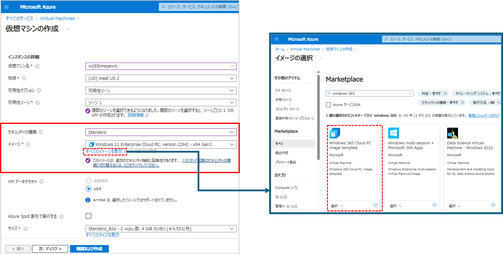

3 ) 仮想マシンが作成されたら、必要に応じてイメージや Teams の最適化、アプリケーションのインストール、Windows の更新プログラムの適用等を実施します。([留意点](#1-留意点) をご参照ください)

4 ) 一般化されたイメージを作成するために sysprep を実行し、仮想マシンをシャットダウンします。
> 参考 : [VHD の一般化 - Azure にアップロードする Windows VHD または VHDX を準備する | Azure Virtual Machines](https://learn.microsoft.com/ja-jp/azure/virtual-machines/windows/prepare-for-upload-vhd-image#generalize-a-vhd)

5 ) 仮想マシンを停止します。


#### 手順 2. キャプチャしてマネージド イメージを作成する
1 ) \[キャプチャ] を選択します。

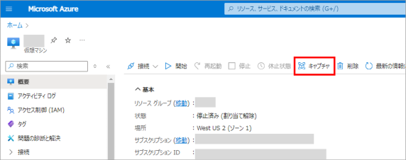

2 ) イメージの作成画面において、 [Azure コンピューティング ギャラリーにイメージを共有する] で [いいえ、マネージド イメージのみをキャプチャします。] を選択します。その他必要な項目を選択し、\[確認および作成] をクリックしてイメージを作成します。

**※ Windows 365 のカスタム イメージは、マネージド イメージをサポートしています。**
**そのため、[はい、ギャラリーに VM イメージ バージョンとして共有します。] を選択してしまうと、Intune にカスタム イメージをアップロードする際に、作成したイメージが読み込まれませんのでご注意ください。**

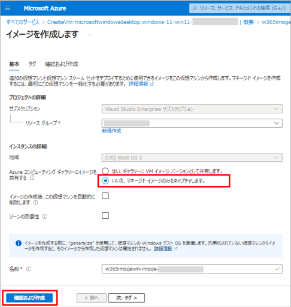

#### 手順 3. マネージド イメージをクラウド PC のカスタム イメージとして Intune にアップロードする
手順については、以下の公開情報をご参照ください。
> 参考 : [カスタム デバイス イメージを追加する - カスタム デバイス イメージを追加または削除する | Windows 365 Enterprise](https://learn.microsoft.com/ja-jp/windows-365/enterprise/add-device-images#add-a-custom-device-image)

※ カスタム イメージのアップロードには、約１～2時間程かかる場合があります。  
※ アップロードのステータスは、通知領域または [カスタム イメージ] タブ の一覧から確認することができます。

#### 手順 4. クラウド PC を再起動して TPM 起動を有効化する
Standard 起動の仮想マシンからイメージを作成した場合、前手順のアップロードで自動的に TPM 起動が有効なカスタム イメージが作成されますが、TPM 起動を完全に有効化するためには、クラウド PC のプロビジョニング後にクラウド PC を再起動する必要があります。

再起動させるタイミングは運用状況によって色々なパターンがあるかと思いますが、ここではクラウド PC をユーザーに展開する前に、対象のクラウド PC を一括で再起動させる方法をご紹介します。

1 ) クラウド PC をプロビジョニングします。詳細は以下の公開情報をご参照ください。
> 参考 : [プロビジョニング ポリシーを作成する | Windows 365 Enterprise](https://learn.microsoft.com/ja-jp/windows-365/enterprise/create-provisioning-policy)

2 ) Intune から指定したすべてのクラウド PCに対して再起動を実行します。

一括操作の手順およびリモートでの再起動については、以下の公開情報をご参照ください。
>参考 : [デバイスの一括アクションを使用する | Intune サービス](https://learn.microsoft.com/ja-jp/mem/intune/remote-actions/bulk-device-actions)  
　　　[Intune でデバイスをリモートで再起動する | Intune サービス](https://learn.microsoft.com/ja-jp/mem/intune/remote-actions/device-restart)

3 ) 再起動後、クラウド PC の TPM 起動が有効となります。状態は、tpm.msc からご確認いただけます。

\# プロビジョニング直後の TPM 管理画面  
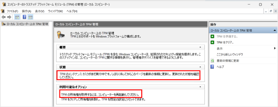

\# 再起動後の TPM 管理画面  
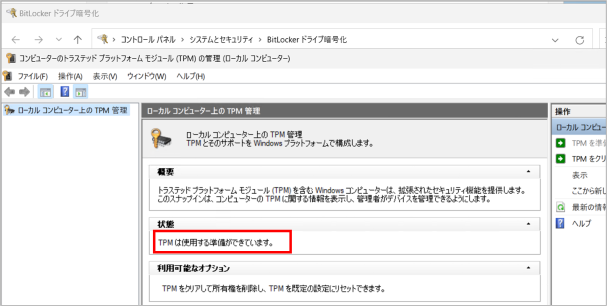
</details>

<details>
<summary>方法 2. Hyper-V の仮想マシンで作成</summary>

### 方法 2. Hyper-V の仮想マシンで作成
手順 1. 仮想マシンを作成しカスタマイズする  
手順 2. VHDX ファイルを VHD 容量固定ファイルに変換する  
手順 3. VHD ファイルをローカルから Azure ストレージ アカウントにアップロードする  
手順 4. Azure イメージ サービスを使用して VHD ファイルからマネージド イメージを作成する  
手順 5. マネージド イメージをクラウド PC のカスタム イメージとして Intune にアップロードする

#### 手順 1. 仮想マシンを作成しカスタマイズする
1 ) Hyper-V マネージャーで仮想マシンを新規作成します。この際、システム要件に沿って仮想マシンの世代は [第 2 世代] (Gen 2) を選択します。

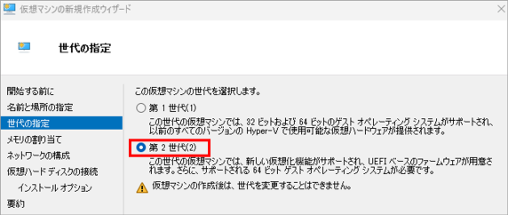

2 ) 仮想マシン作成後、設定のセキュリティ画面を開き [トラステッド プラットフォーム モジュールを有効にする] にチェックを入れます。  
※ 本操作を行わない場合、Windows 11 においては ISO ファイル読み込み後の OS セットアップでシステム要件を満たすよう求められます。

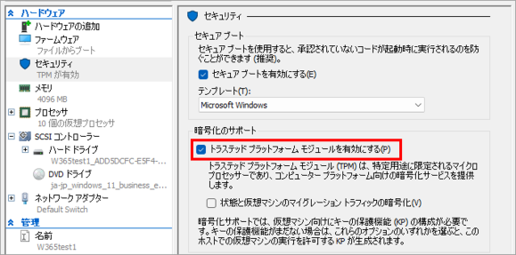

3 ) ISO イメージファイルを用いて OS のセットアップを行い、イメージや Teams の最適化、アプリケーションのインストール、Windows の更新プログラムの適用等を実施します。 ([留意点](#1-留意点) をご参照ください)

4 ) 一般化されたイメージを作成するために sysprep を実行し、仮想マシンをシャットダウンします。
> 参考 : [VHD の一般化 - Azure にアップロードする Windows VHD または VHDX を準備する | Azure Virtual Machines](https://learn.microsoft.com/ja-jp/azure/virtual-machines/windows/prepare-for-upload-vhd-image#generalize-a-vhd)

5 ) チェックポイントが存在する場合は、チェックポイントを削除します。  
　**※ チェックポイントが存在する状態の VHDX を使用すると、Intune へのカスタム イメージ アップロードに失敗します。**

#### 手順 2. VHDX ファイルを VHD 容量固定ファイルに変換する
作成した仮想マシンのディスクは VHDX 形式のため、VHD 形式に変換する必要があります。  
変換前にディスクを最適化し、変換時にディスクの容量を固定化します。
> 参考 : [ディスクを固定サイズと VHD 形式に変換する - 既存のカスタム デバイス イメージを第 2 世代の仮想マシンに変換する | Windows 365 Enterprise](https://learn.microsoft.com/ja-jp/windows-365/enterprise/device-images-convert-generation-2#convert-the-disk-to-a-fixed-size-and-vhd-format)

1 ) Hyper-V マネージャーで \[ディスクの編集] を開き、\[ディスクの場所] ページで手順 1. で作成した仮想マシンの VHDX を選択します。

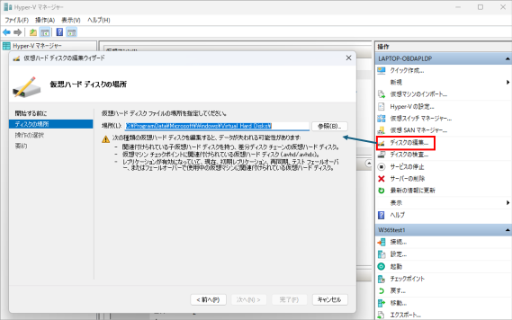

2 ) \[操作の選択] ページで \[最適化] を選択し、\[完了] をクリックします。

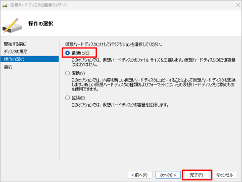

3 ) 再度、\[ディスクの編集] 画面を開き対象の VHDX ファイルを選択します。

4 ) \[操作の選択] ページで \[変換] を選択し、 \[次へ] をクリックします。

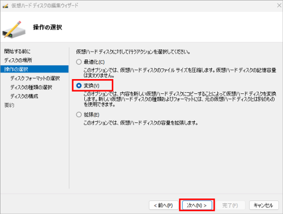

5 ) 下図の画面で次のとおり選択し、任意の VHD 容量固定ファイル名と保存場所を選択して、\[完了] をクリックします。
- \[ディスクフォーマットの選択] : VHD
- \[ディスクの種類の選択] : 容量固定


#### 手順 3. VHD ファイルをローカルから Azure ストレージ アカウントにアップロードする
Azure Storage Explorer を使用して (推奨)、ローカルの VHD ファイルを Azure ストレージ アカウントの Blob コンテナーにアップロードします。
> 参考 : [変換された VHD を Azure にアップロードします - 既存のカスタム デバイス イメージを第 2 世代の仮想マシンに変換する | Windows 365 Enterprise](https://learn.microsoft.com/ja-jp/windows-365/enterprise/device-images-convert-generation-2#upload-the-converted-vhd-to-azure)

>**事前準備：** ストレージ アカウントを作成し、[Azure Storage Explorer](https://azure.microsoft.com/en-us/products/storage/storage-explorer/) をインストールします。  
> 参考 : [Azure Storage アカウントを作成する | Azure ストレージ](https://learn.microsoft.com/ja-jp/azure/storage/common/storage-account-create?tabs=azure-portal)

1 ) Azure Storage Explorer を起動し、対象のストレージ アカウントのコンテナーに VHD ファイルをアップロードします。

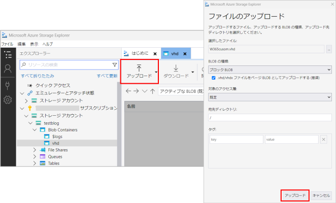

#### 手順 4. Azure イメージ サービスを使用して VHD ファイルからマネージド イメージを作成する
1 ) Azure poral の \[イメージ] サービスにアクセスし、 \[+作成] をクリックします。

2 ) 必要なフィールドを入力しイメージを作成します。作成されたイメージはマネージド イメージに格納されます。
- VMの世代は、システム要件に沿って [Gen 2] を選択します
- ストレージ BLOBで、アップロードした VHD を選択します


#### 手順 5. マネージド イメージをクラウド PC のカスタム イメージとして Intune にアップロードする
手順については、以下の公開情報をご参照ください。
> 参考 : [カスタム デバイス イメージを追加する - カスタム デバイス イメージを追加または削除する | Windows 365 Enterprise](https://learn.microsoft.com/ja-jp/windows-365/enterprise/add-device-images#add-a-custom-device-image)

※ カスタム イメージのアップロードには、約１～2時間程かかる場合があります。  
※ アップロードのステータスは、通知領域または [カスタム イメージ] タブ の一覧から確認することができます。
</details>

<details>
<summary>番外編. Azure Virtual Machine (トラステッド起動) で作成</summary>

### 番外編. Azure Virtual Machine (トラステッド起動) で作成
手順 1. TPM 起動の仮想マシンを作成しカスタマイズする  
手順 2. VHD ファイルを Azure ストレージ アカウントに copy する  
手順 3. Azure イメージ サービスを使用して VHD ファイルからマネージド イメージを作成する  
手順 4. マネージド イメージをクラウド PC のカスタム イメージとして Intune にアップロードする  

TPM 起動の Azure VM からイメージを作成する場合は、以下の理由から Standard 起動の Azure VM とは異なる手順となります。
 
Windows 365 のカスタム イメージはマネージド イメージである必要がありますが、現在、TPM 起動の仮想マシンがマネージド イメージをサポートしていないため、Azure VM のキャプチャでは作成したイメージをマネージド イメージに格納することができません。そのため、TPM 起動の Azure Virtual Machine でイメージを作成する場合、ディスクのイメージ化は Azure VM のキャプチャではなく、Azure イメージサービスを使用します。  
Azure イメージ サービスでは VHD ファイルからイメージ作成が可能で、作成されたイメージはマネージド イメージに格納されます。

#### 手順 1. TPM 起動の仮想マシンを作成しカスタマイズする
1 ) Azure portal の [Virtual Machine] サービスにアクセスし、\[+作成] > [Azure 仮想マシン] を選択します。


2 ) 必要なフィールドを入力し、Azure 仮想マシンを作成します。
- セキュリティの種類は \[トラステッド起動の仮想マシン] を選択します
- イメージは、Windows 365 クラウド PC 用のギャラリー イメージの使用を推奨します ([留意点](#1-留意点) をご参照ください)  
※ 選択項目下の \[すべてのイメージを表示] リンクから Windows 365 Cloud PC image template が選択できます。

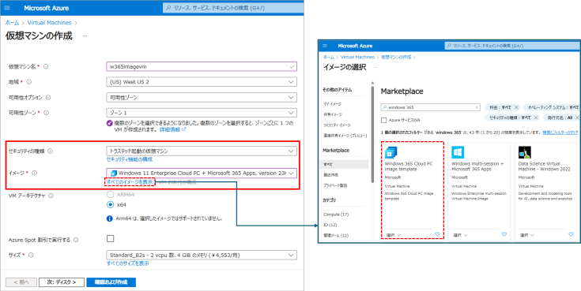

3 ) 仮想マシンが作成されたら、必要に応じてイメージや Teams の最適化、アプリケーションのインストール、Windows の更新プログラムの適用等を実施します。([留意点](#1-留意点) をご参照ください)

4 ) 一般化されたイメージを作成するために sysprep を実行し、仮想マシンをシャットダウンします。
> 参考 : [VHD の一般化 - Azure にアップロードする Windows VHD または VHDX を準備する | Azure Virtual Machines](https://learn.microsoft.com/ja-jp/azure/virtual-machines/windows/prepare-for-upload-vhd-image#generalize-a-vhd)

5 ) 仮想マシンを停止します。


#### 手順 2. VHD ファイルを Azure ストレージ アカウントに copy する
Azure 仮想マシンの OS ディスク エクスポート URL を生成し、ストレージ アカウントに VHD ファイルを copy します。  
ここでは、Cloud Shell を利用して azcopy コマンドを使用する例をご紹介します。

> **事前準備** ストレージ アカウントを作成し、[Azure Storage Explorer](https://azure.microsoft.com/en-us/products/storage/storage-explorer/) をインストールします。  
> 参考 : [Azure Storage アカウントを作成する | Azure ストレージ](https://learn.microsoft.com/ja-jp/azure/storage/common/storage-account-create?tabs=azure-portal)

1 ) Azure portal で仮想マシンを開き、OS ディスクのダウンロード URL を生成します。ここで生成した URL は、azcopy 実行時に使用します。

手順については、以下の公開情報をご参照ください。
> 参考 : [ダウンロード URL の生成 - Azure から Windows VHD をダウンロードする | Azure Virtual Machines](https://learn.microsoft.com/ja-jp/azure/virtual-machines/windows/download-vhd?tabs=azure-portal#generate-download-url)

2 ) Azure portal でストレージ アカウントを開き、左ペインの [データ ストレージ] > \[コンテナー] からコピー先のコンテナに移動します。

3 ) 左ペインの [共有アクセス トークン] を開き、書き込み可能なアクセス許可を設定します。  
[SAS トークンおよび URL を生成] をクリックして、ー時的にアクセスが可能な制限付き URL を生成します。  
ここで生成した URL は、azcopy 実行時に使用します。

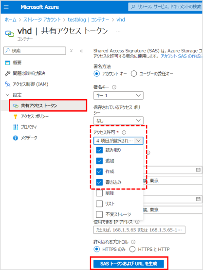

4 ) Azure portal から Cloud Shell を起動します。


5 ) azcopy コマンドを利用して、VHD ファイルをストレージアカウントにコピーします。
> 参考 : [AzCopy v10 を使用して Azure ストレージ アカウント間で BLOB をコピーする | Azure storage](https://learn.microsoft.com/ja-jp/azure/storage/common/storage-use-azcopy-blobs-copy)

\# 変数を用いたコマンド実行例  (※ \[Shift] + \[Insert] キー でペーストが可能です)
```
$ export DEST_URL="<コピー先のストレージアカウントの URL (コピー先)>"
$ export FROM_URL="<エクスポート用に生成された URL (コピー元)>"
$ azcopy copy $FROM_URL $DEST_URL  --blob-type PageBlob
```

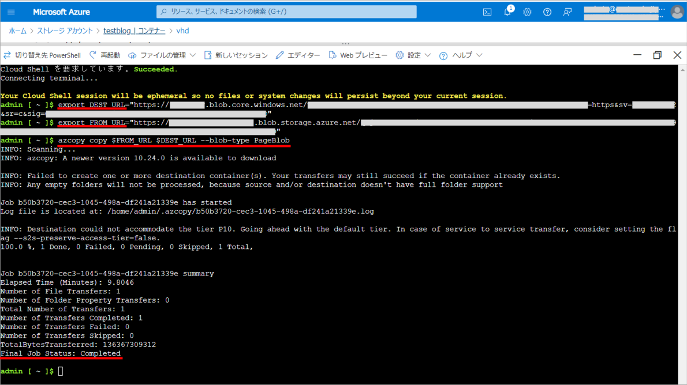

#### 手順 3. Azure イメージ サービスを使用して VHD ファイルからマネージド イメージを作成する
1 ) Azure poral の \[イメージ] サービスにアクセスし、 \[+作成] をクリックします。

2 ) 必要なフィールドを入力しイメージを作成します。作成されたイメージはマネージド イメージに格納されます。
- VMの世代は、システム要件に沿って [Gen 2] を選択します
- ストレージ BLOBで、アップロードした VHD を選択します


#### 手順 4. マネージド イメージをクラウド PC のカスタム イメージとして Intune にアップロードする
手順については、以下の公開情報をご参照ください。
> 参考 : [カスタム デバイス イメージを追加する - カスタム デバイス イメージを追加または削除する | Windows 365 Enterprise](https://learn.microsoft.com/ja-jp/windows-365/enterprise/add-device-images#add-a-custom-device-image)

※ カスタム イメージのアップロードには、約１～2時間程かかる場合があります。  
※ アップロードのステータスは、通知領域または [カスタム イメージ] タブ の一覧から確認することができます。
</details>

## 3. 補足
---
◆ **sysprep 実行時に以下のようなエラーが出た場合**  
外部のサイトではございますが、弊社社員の以下のブログ記事の対処方法をご参照ください。
> 参考 : [Windows 365 : カスタム イメージを使用する vol.1 - 作成編](https://zenn.dev/microsoft/articles/3d34892fc29272)

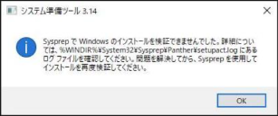

◆ **Azure VM は sysprep 実行後は起動できません**  
Azure VM を別途利用したい場合は、停止した上で sysprep 実行前にスナップショットを作成、ダウンロードします。
> 参考 : [代替手段: VM ディスクのスナップショットを作成する - Azure から Windows VHD をダウンロードする | Azure Virtual Machines](https://learn.microsoft.com/ja-jp/azure/virtual-machines/windows/download-vhd?tabs=azure-portal#alternative-snapshot-the-vm-disk)

◆ **azcopy を使ってローカルの VHD ファイルを Azure ストレージアカウントにコピーする方法**  
Hyper-V の仮想マシンからイメージを作成する場合において、Azure ストレージ アカウントにローカルの VHD ファイルをコピーする方法として Azure Storage Explorer をご紹介しましたが、azcopy も使用できます。

例）
```
　azcopy copy "<コピー元ディレクトリ>" "<コピー先 ストレージ アカウントの SAS URL>" --blob-type Pageblob
```
ストレージアカウントの SAS URL の取得方法、および azcopy の実行手順については、番外編. Azure Virtual Machine (TPM 起動) で作成 の手順 2. をご覧ください。

今回の投稿は以上です。  
不明点などがありましたら、弊社サポートサービスまでお気軽にお問合せください。
